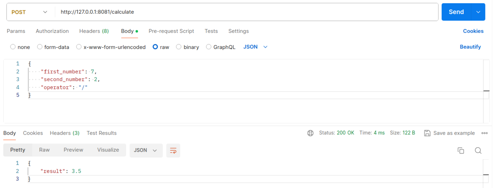

# Рубежный контроль №1. Разработка WEB-сервера на Golang

Рубежный контроль пишется очно на паре лобораторных работ.

В рамках данного РК необходимо реализовать простой сервер на Golang, принимающий клиентские запросы по протоколу HTTP.
 
## Шаблон

Шаблоном для на написания РК является данный репозиторий. В качестве подготовки к РК желательно заблаговременно склонить данный репозиторий и проверить, что сервер корректно запускается, а клиентские запросы обрабатываются в соответствии с заданием в демонстрационном билете.
 
## Демонстрационный билет №1. Простой калькулятор

Необходимо написать веб-севрер на GO, реализующий логику простого кулькулятора. Сервер должен запускаться по адресу `127.0.0.1:8081`.

У севрера должна быть ручка (handler) `POST /calculate`. Эта ручка в теле запроса должна принимать JSON с 3 полями: `first_number`, `second_number` и `operator`. 

При обработке http-запроса с переданными числами должна производиться соответствующая математическая операция, которая была передана в поле `operator`: `+`, `-`, `*` или `/`. 

В качестве ответа сервер должен возвращаться JSON с единственным полем `result`.

Примерм запроса (curl):
```
curl --header "Content-Type: application/json" --request POST --data '{"first_number":7,"second_number":2,"operator":"/"}' http://127.0.0.1:8081/calculate
```

Пример ответа:
 ```
{"result":3.5}
 ```

Образец решения данного билета можно посмотреть в репозитории https://github.com/ValeryBMSTU/web-rk1 в файле `main.go`

## Защита

Защита РК (как и написание) проходит очно на паре лабораторных работ. Во время защиты РК необходимо показать код на golang и продемонстрировать правильность обработки http-запросов c использованием какого-нибудь из клиентов из перечня: Postman, Insomnia, Curl

Образец корректно обработанного запроса для демонстрационного билета №1 через Postman:

 

## Отчёт 

Отчёт оформляется **ПОСЛЕ** защиты рубежного контроля и должен содержать:

1. Титульный лист
2. Задание
3. Решение

Получившийся отчёт наобходимо запушить в личный форк данного репозитория

## Дополнительные сведения

Поскольку первый рубежный контроль будет по языку Golang, то рекомендуется для успешного написания РК1 к 6-7 неделе семестра выполнить следующие лабораторные работы:
-  "3. Основы Golang"
-  "5. Основы асинхронного программирования на Golang"
-  "6. Основы Back-End разработки на Golang"
